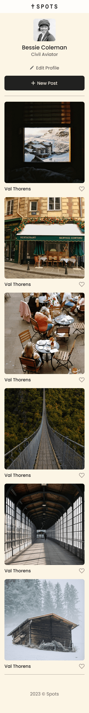
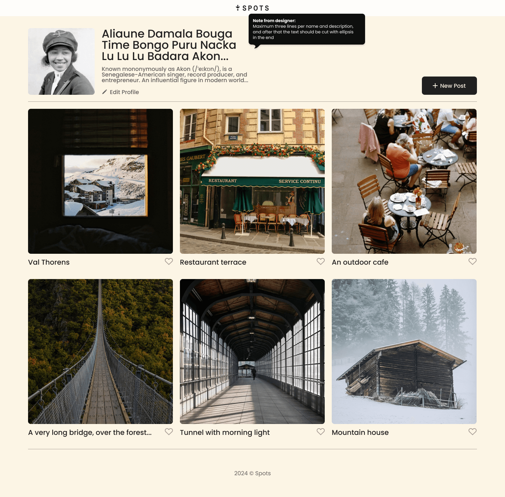
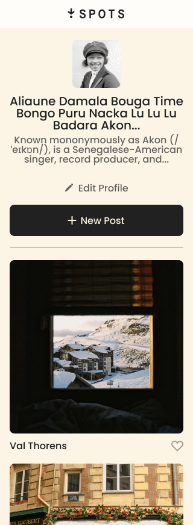

# Spots

This is the third project of the Software Engineering program at TripleTen.

Spots is a social media web application created using HTML and CSS. It is based on a Figma design that supports layouts for mobile, tablet, and desktop.

## Tech Stack

- Semantics HTML5
- CSS
- Grid Layout
- Flexbox
- BEM file structure
- DevTools
- Media Queries

## Overview

- Intro
- Figma
- Images

**Intro**
Spots allows users to customize their profiles, add or remove and caption photos, as well as like photos from other users.

The web application is built according to responsive web design practices and contains hover functionality for best user experience.

**Figma**

- [Link to the project on Figma](https://www.figma.com/file/BBNm2bC3lj8QQMHlnqRsga/Sprint-3-Project-%E2%80%94-Spots?type=design&node-id=2%3A60&mode=design&t=afgNFybdorZO6cQo-1)

**Images**

Desktop Version - 1440px (with no text overflow):

Mobile Version - 320px (with no text overflow):

Desktop Version - 1440px (with text overflow):

Mobile Version - 320px (with text overflow):

## Plans on Improving the project

I would like to improve this project in the future by incorporating forms which will enable users to receive information on who liked their recent posts and fully customize their profiles.
